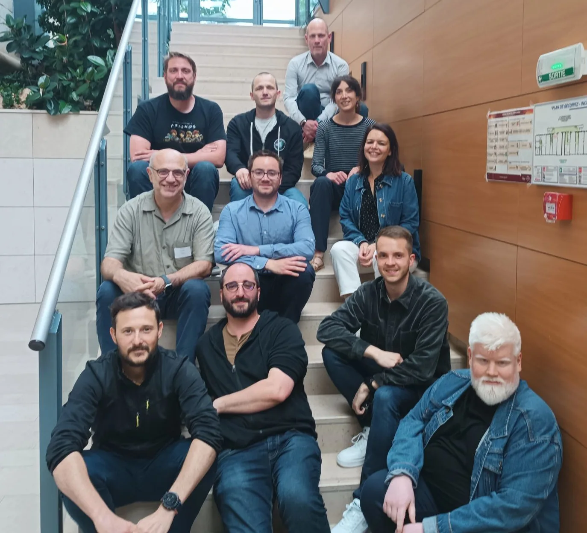

== Qui sommes-nous ?

Créé en juin 2022 à l'initiative de Dijon Métropole et d'une quinzaine d'acteurs du numérique locaux, le *Developers Group Dijon* est une *association de bénévoles* ayant pour vocation de fédérer et animer la communauté des développeur·euse·s de la région dijonnaise. Elle organise des événements réguliers pour leur permettre d'échanger et de partager leur expérience.

L'association est également soutenue par des *entreprises et organismes locaux* qui n'hésitent pas à mettre à disposition les ressources nécessaires à son bon fonctionnement (bénévolat d'entreprise, accueil d'événements, mise à disposition de compétences…).

L'association ne serait pas là sans leur soutien !

== Ils font vivre l'asso

* Adrien Gras, Owlnext
* Fabrice Ubertosi, Cpage
* Jérémy Colombet, Garganttua
* Matthieu Lamalle, Cadoles
* Caroline Chanlon, Osanah communication
* Allan Cruchaudet, Dijon Bourgogne Invest
* Xavier Calland, Atol CD
* Mathilde Couenne, Alteca
* Yoann Rouquié, APRR
* Michel Girard, DIIAGE
* Guillaume Poittevin, Capgemini

[#rejoignez-nous]
== Rejoignez-nous

L'association Developers Group Dijon est ouverte à tout type de structure : entreprises de la tech, startups, écoles et université, laboratoires, organismes publics… et n'engage pas de frais d'adhésion.

L'animation de l'association se fait sur la base du bénévolat.

Les membres ont pour mission principale d'organiser les événements qui ont lieu environ 4 fois par an avec le DevFest en point d'orgue en décembre : concertation dans le choix du type d'événement, définition des programmes et choix des speakers, communication, logistique…

Tous les membres ne participent pas à l'organisation de tous les événements ! Vous participez quand vous pouvez 🙂 Vous pouvez vous impliquer un peu, beaucoup ou passionnément !

mailto:developers.group.dijon@gmail.com[Contactez-nous pour avoir plus d'infos,role=button]
