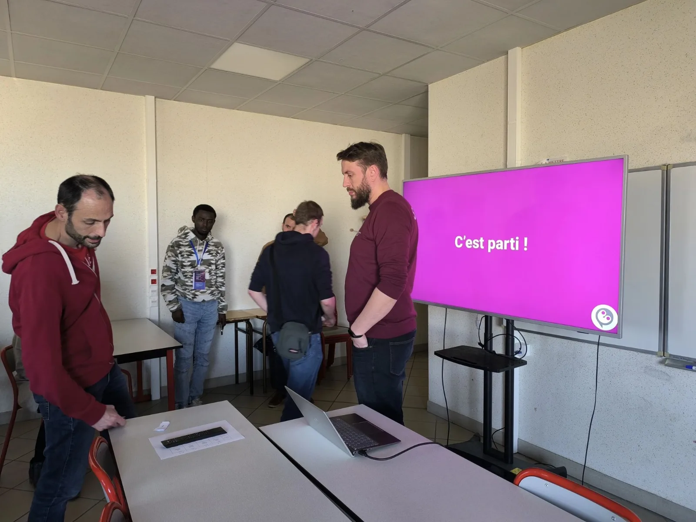
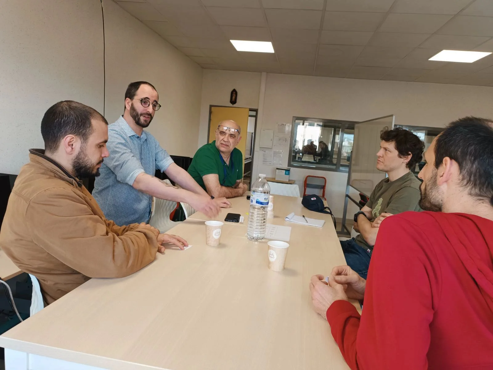
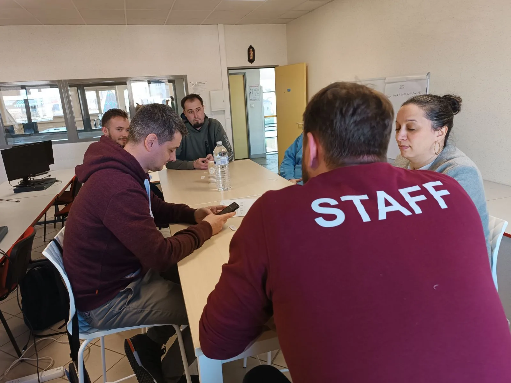
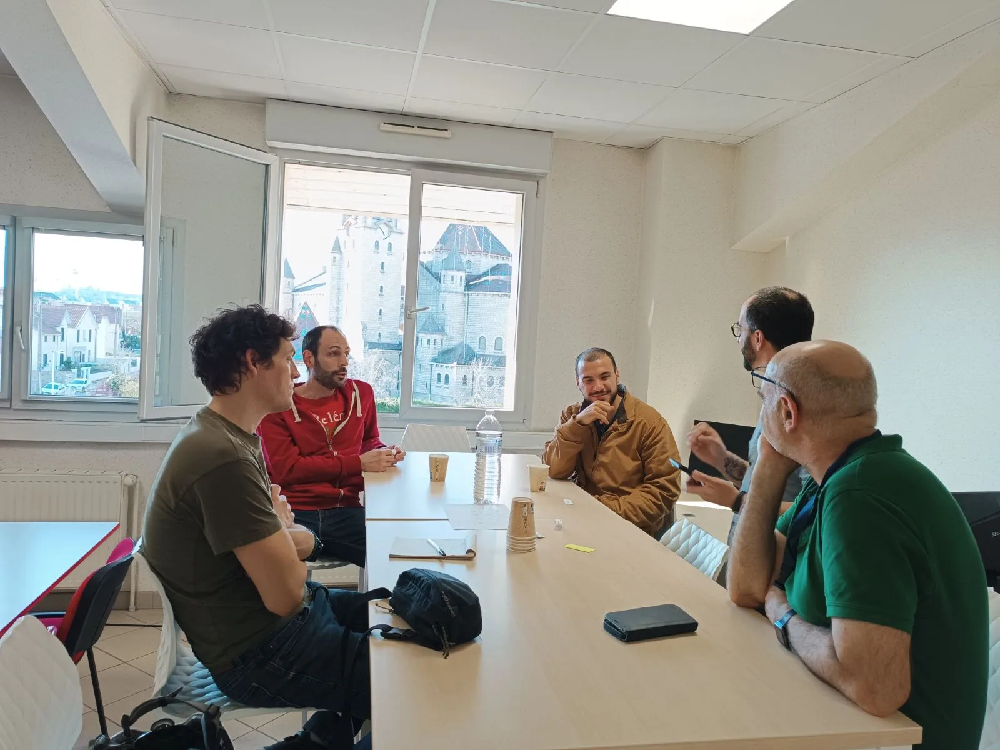

*Mardi 21 Mars*, c’était le tout *premier événement de l’année 2024* pour le Developer’s Group. C’était un réel plaisir de vous retrouver pour échanger avec vous sur des sujets techs lors de notre *Speed-Teching* ! Au programme, trois rounds de discussion sur des *sujets techs*. Une fois les petits groupes constitués, place aux échanges :  IA, Docker, NoSQL, sécurité, authentification, DevOps, CSS et bien d’autres … Chacun a eu l’opportunité de *partager son expertise et son expérience*, de quoi enrichir les débats.

C’était un réel plaisir de vous retrouver et d’échanger avec vous lors de ce Speed-Teching. Un grand merci au Diiage pour son accueil !

Et pour la suite ? *On vous retrouve en Juin !! 😉*
