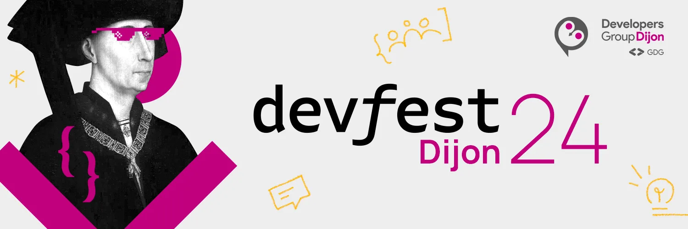

La *3ème édition* du *DevFest Dijon* se tiendra *vendredi 6 décembre 2024* à l’*IUT Dijon* sur le campus universitaire.

L’*appel à communication* est ouvert jusqu’au *15 juillet 2024*, avec au choix deux formats de Talks ⬇️ +
– 🧝‍♀️ Short talk : 20 minutes +
– 🧙 Conférence : 50 minutes

👾🤖 Le DevFest est une grande journée de conférences et ateliers dédiée à la communauté de développeurs débutants et expérimentés !

https://devfest.developers-group-dijon.fr/

Il n’y a pas de thème défini pour le DevFest, *tous les sujets sont les bienvenus* : mobile, web, cloud & devops, BigData & AI, UX/UI, IoT & hardware, … !

✅ https://conference-hall.io/public/event/LvvYRcF5AIhpojdn2lkQ[Vous pouvez proposer un sujet via la plateforme dédiée]

Merci par avance à *IUT Dijon-Auxerre-Nevers* pour son accueil !

https://devfest.developers-group-dijon.fr/[Plus d’informations sur l’événement]
