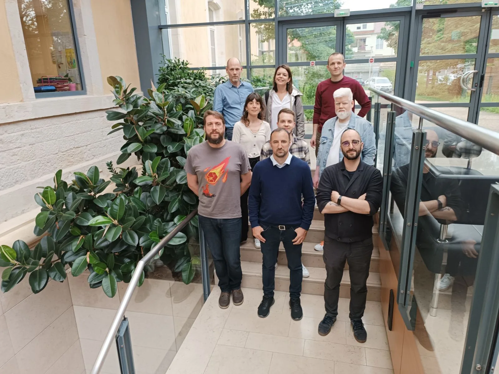
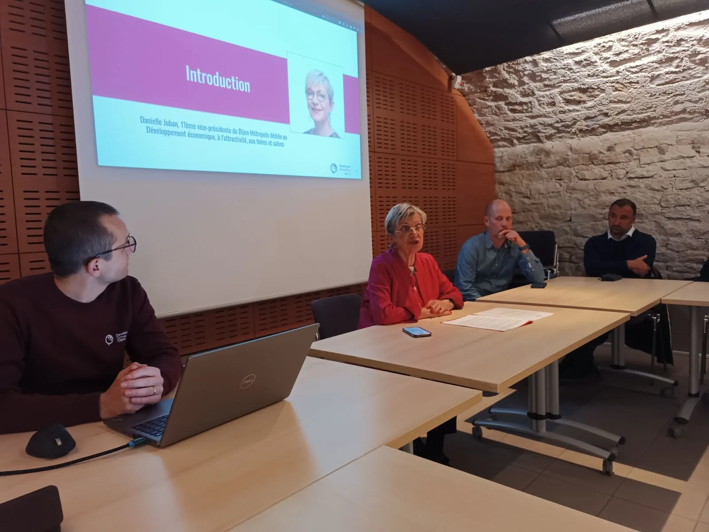
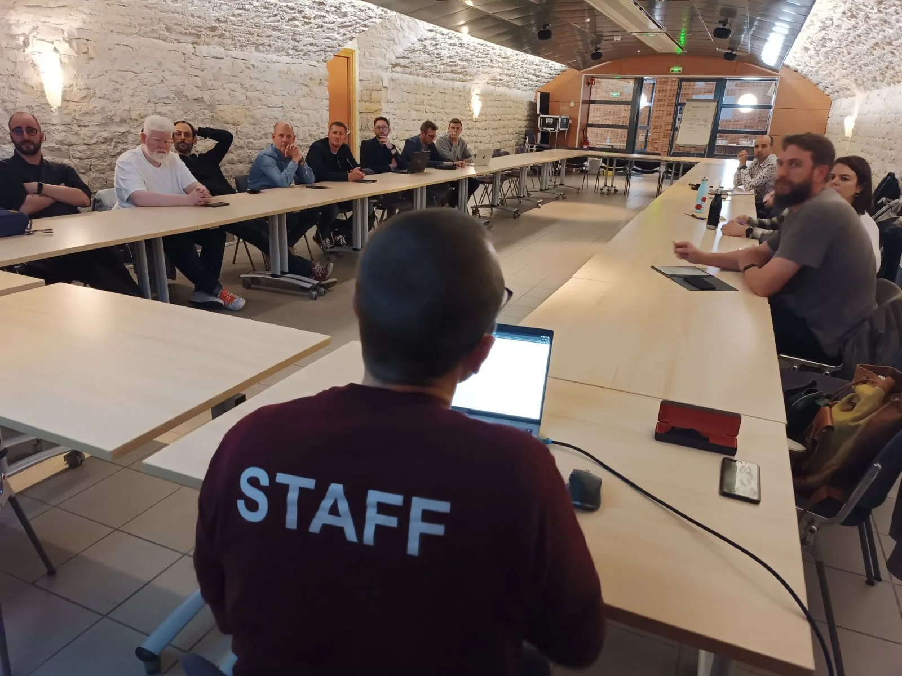
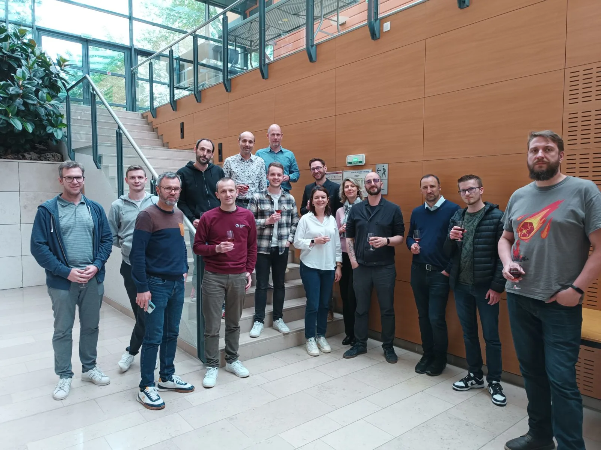

Le *Jeudi 16 Mai* se déroulait la *première Assemblée générale* de notre association !

*Danielle JUBAN*, *vice présidente de Dijon métropole* nous a fait l’honneur d’introduire cette assemblée. Avec en prime l’annonce exclusive de la construction d’une *nouvelle SEM patrimoniale dédiée aux acteurs du numérique* ! +

Après un bilan sur l’année 2023 – début 2024 et une projection sur les événements à venir, place aux votes ! Voici les résultats :

* *Xavier Calland* est élu *président de l’association*.
* *Caroline Chanlon* et *Guillaume Poittevin* sont élus *secrétaires*.
* *Nicolas Le Pochat* est élu *trésorier*

Après la présentation du rapport financier de l’année 2023, projection sur 2024-2025 ! Il se pourrait même que l’a prochaine édition du DevFest DIjonnais ait été annoncée, plus d’information à venir…😉

En attendant, nous vous donnons *rendez-vous le mardi 18 Juin 2024 à 16h30* dans les nouveaux locaux de *CPage*, *situés 21 ter Av. Françoise Giroud, à Dijon* pour nos https://my.weezevent.com/2024-06-conferences[conférences focus sur l’architecture logicielle] !
