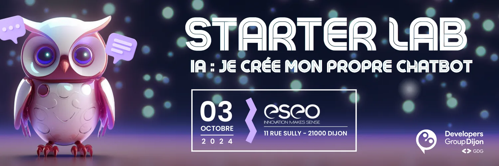

== 2024-10 - Starter Lab LLM et Chatbot

Le Developers Group Dijon vous invite à un *Starter Lab orienté LLM*. +
Lors de cet atelier, vous serez guidés pas-à-pas pour réaliser un Chatbot.

Au programme :

* Interaction avec un modèle LLM
* Prompt engineering
* Spécialisation du modèle avec RAG et fine-tuning

Nous vous donnons donc rdv le *jeudi 3 Octobre 2024 à 16h30* à l’*ESEO* situé 11 rue Sully, à Dijon.

Tous les pré-requis et instructions pour préparer votre PC avant l’atelier seront fournis sur le *https://github.com/developers-group-dijon/2024-starterlab-llm-chatbot[dépôt Github de l’atelier]*.

*Date* : 03/10/2024 +
*Horaires :* 16h30 – 18h30 * +
Lieu* : ESEO Dijon

link:https://www.openstreetmap.org/search?query=11+Rue+Sully,+21000+Dijon[Voir sur la carte,role=map]

link:https://my.weezevent.com/2024-10-starter-lab-llm-chatbot[Inscription,role=button]
