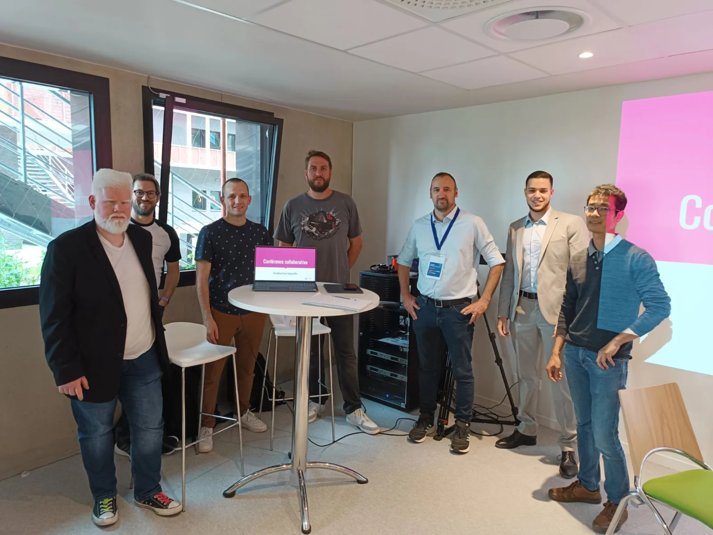
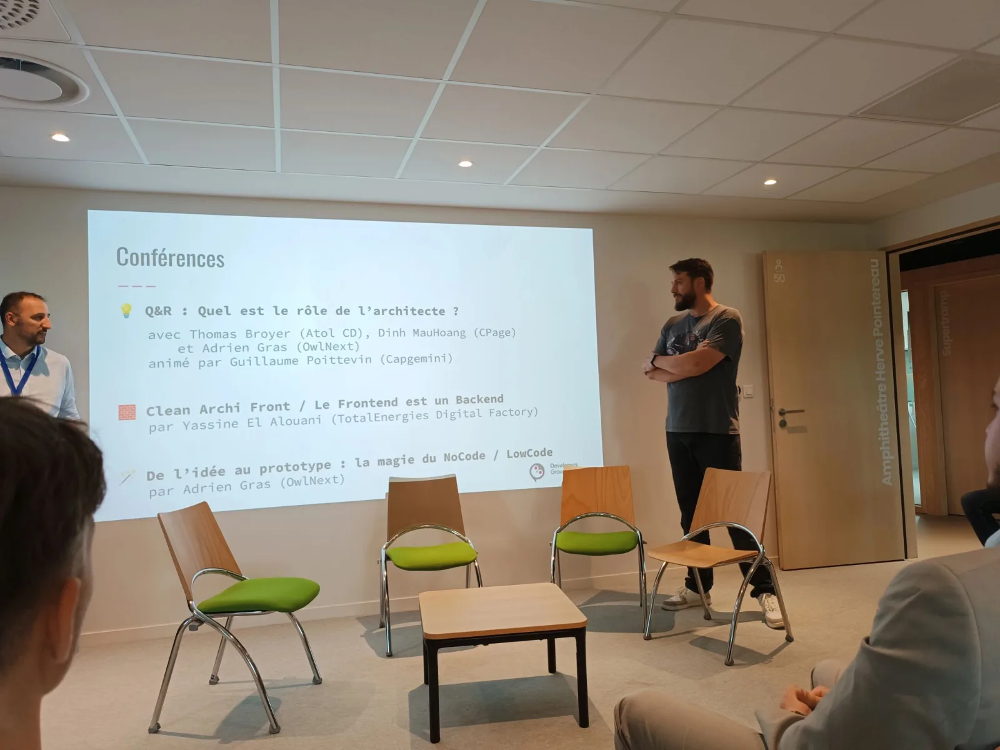
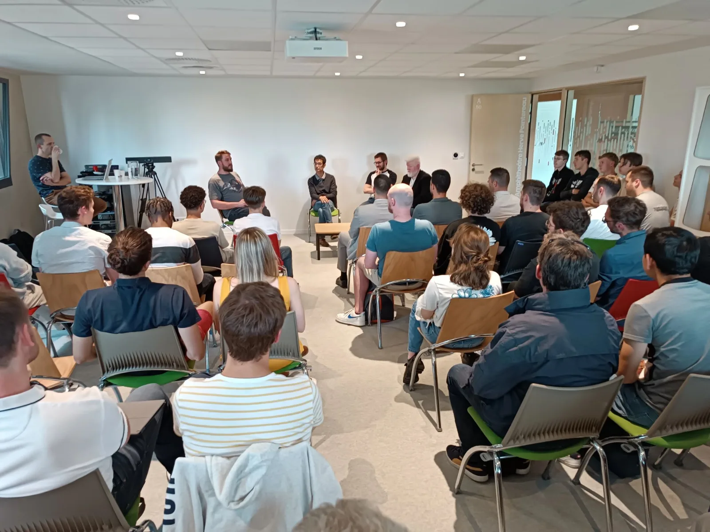
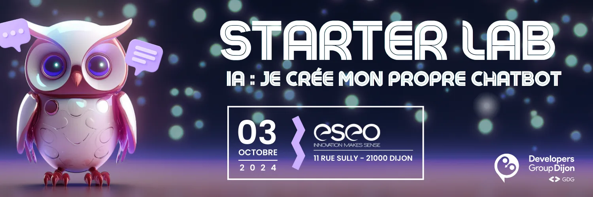

Le *18 Juin* dernier, l’*Architecture Logicielle* était le sujet clé de notre dernier événement. Trois conférences étaient au programme !

Pour lancer les échanges, une *table ronde interactive* a permis de libérer les échanges et de mettre des mots sur ce rôle clé aux facettes multiples. Ensuite, c’était au tour de *Yassine El Alouani* de prendre la parole et d’animer une sa conférence : *Clean Archi Front / Le Frontend est un Backend*. Pour clôturer cette session de conférence, c’est *Adrien Gras* qui a animé sa conférence : *Clean Archi Front / Le Frontend est un Backend*.

Un grand merci à CPage pour son accueil, à nos conférenciers et à vous de toujours répondre présent à nos événements, on se retrouve en Octobre ? 😉

== Starter Lab : réalisez votre chatbot !

https://my.weezevent.com/2024-10-starter-lab-llm-chatbot

Pour son prochain évènement, le Developers Group Dijon vous invite à un *Starter Lab orienté LLM*. Lors de cet atelier, vous serez guidés pas-à-pas pour réaliser un Chatbot.

*Au programme :*

* Interaction avec un modèle LLM
* Prompt engineering
* Spécialisation du modèle avec RAG et fine-tuning

Nous vous donnons donc rdv le *jeudi 3 Octobre 2024 à 16h30* à l’*ESEO* situé 11 rue Sully, à Dijon.

link:https://my.weezevent.com/2024-10-starter-lab-llm-chatbot[Inscrivez-vous !,role=button]
