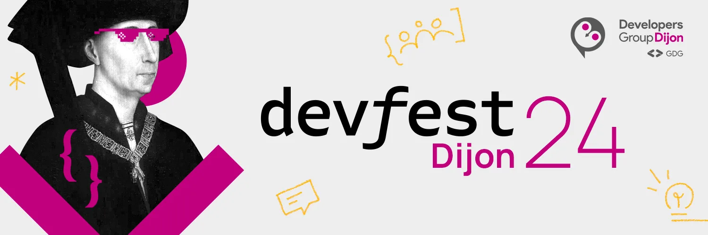

== DevFest Dijon 2024

Le Developers Group Dijon (GDG-Dijon) propose la *troisième édition du DevFest Dijon le 6 décembre 2024*. +
Nouveauté pour cette année : *3 salles pour une capacité de 450 personnes*.

Et c’est parti ! La billetterie pour le DevFest Dijon 2024 est enfin ouverte ! 🎉

Le DevFest est une grande journée de conférences et ateliers dédiée à la communauté de développeurs débutants et expérimentés. Au programme : 18 conférences, 6 talks et surtout de beaux moments de partage en perspective avec la communauté tech

RDV à l’IUT Dijon-Auxerre-Nevers pour notre événement incontournable de l’année ! Les places sont limitées, alors ne tardez pas. On vous attend nombreux !

*Date* : vendredi 6 décembre 2024 +
*Horaires :* 9h – 17h * +
Lieu* : IUT Dijon

link:https://www.openstreetmap.org/search?query=7+Bd+Dr+Petitjean,+21078+Dijon[Voir sur la carte,role=map]

link:https://my.weezevent.com/devfest-dijon-2024[Inscription,role=button]
