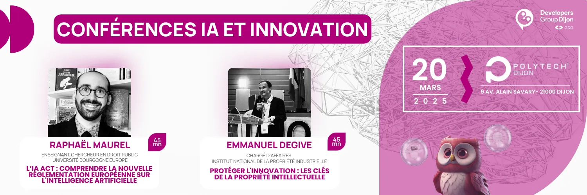

== 2025-03 - Conférences IA et innovation

Le Developers Group Dijon vous invite à son premier événement de l’année ! Focus sur les enjeux juridiques et stratégiques du numérique en matière d’innovation et d’intelligence artificielle le jeudi 20 mars 2025 à 16h30 à Polytech Dijon sur le campus universitaire.

*Au programme*

* *⚖️ Conférence 1 – L’IA Act : comprendre la nouvelle réglementation européenne sur l’Intelligence Artificielle par Raphaël Maurel.*

Découvrez les implications concrètes de cette législation majeure pour le secteur numérique avec notre expert, enseignant-chercheur en droit public à l’Université de Bourgogne.

* *💡 Conférence 2 –  Protéger l’innovation : les clés de la propriété intellectuelle par Emmanuel Degive.*

Plongez dans les stratégies de protection de vos innovations avec notre intervenant de l’INPI. Une session essentielle pour comprendre comment sécuriser vos développements et valoriser votre propriété intellectuelle.

*📅 Rendez-vous le jeudi 20 mars 2025 à 16h30 !*

Chaque conférence durera 45 minutes et sera suivie d’un temps d’échange avec les intervenants.

🍻 Les présentations seront suivies d’un moment convivial pour poursuivre les discussions

*Date* : 20/03/2025 +
*Horaires :* 16h30 – 18h30 * +
Lieu* : Polytech Dijon

link:https://www.openstreetmap.org/search?query=9+Av.+Alain+Savary,+21000+Dijon[Voir sur la carte,role=map]

link:https://my.weezevent.com/2025-03-conferences-inpi-et-ia[Inscription,role=button]
