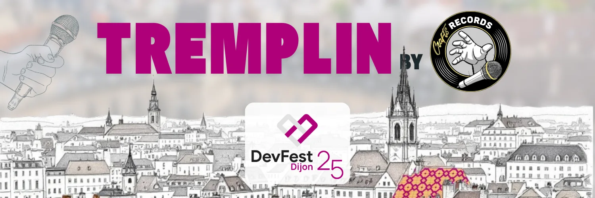

== 13 Novembre 2025 - Tremplin DevFest

Le prochain événement du https://www.linkedin.com/company/developers-group-dijon/[*Developers Group Dijon*] est prévu *jeudi 13 Novembre de 17h à 20h au chez BPCE SI*.

Organisé en partenariat avec https://www.linkedin.com/company/craftsrecords/[*CraftsRecords,*] venez assister aux conférences animées par des primo-speakers, un bel entraînement avant le DevFest Dijon 2025 !

Au programme, *5 conférences* :

=== ➡️ *Bienvenue dans l’équipe. Voici ton onboarding. Puisse le sort vous être favorable – Sébastien RIBIERE*

_Jade vient de rejoindre une équipe platform._ +
_Dans une timeline, elle est autonome en une heure, déploie en staging avant la pause dej, et te remonte une PR d’amélioration du pipeline le lendemain._ +
_Dans une autre, elle passe trois jours à chercher un accès VPN, ne comprend pas où est la vérité (dans Notion ? GitLab ? Slack ?), et finit par dire “je crois que je vais faire comme avant”._

_Même Jade._ +
_Même équipe._ +
_Même stack._ +
_Seule différence : l’onboarding._

_Dans ce talk, on remonte le fil de ces deux timelines parallèles pour montrer à quel point un bon onboarding n’est pas un luxe, mais une feature à part entière de ta platform._ +
_Au programme :_ +
_– Les erreurs qui ruinent l’expérience des premiers jours_ +
_– Des patterns inspirés du design produit (progressive disclosure, First Time User Expérience, feedback loop…)_ +
_– Une méthode pour rendre ton onboarding mesurable, itérable, et vivant_ +
_Parce qu’une bonne plateforme, c’est pas juste “Kubernetes + GitOps + Terraform”._ +
_C’est un environnement où les devs peuvent réussir sans demander “je commence par quoi ?”._ +
_Si ton onboarding est un test d’endurance, t’étonne pas que tes devs abandonnent avant le premier sprint._

=== ➡️ **IA générative et réchauffement climatique : comment réduire la facture? – Emilie GREFF & Arielle VILLA-MASSONE**

_L’IA générative fascine, mais elle chauffe… et pas seulement les GPU.
_ _Derrière ses prouesses se cache une empreinte écologique massive : data centers énergivores, entraînements XXL, matériaux rares, et aussi une adoption massive…_

_Lors de cette présentation, nous passerons en revue le véritable coût écologique de l’IA tout au long de sa chaîne de valeur, et surtout, nous identifierons des leviers concrets pour concevoir des systèmes plus responsables, sans sacrifier leur performance._

_L’objectif : comprendre l’impact de l’IA générative sur l’environnement et repartir avec des bonnes pratiques actionnables pour réduire son empreinte._

_À l’issue de cette session, vous repartirez avec l’œil d’un détective : les anomalies visuelles se cachent dans tous les sujets qui vous entourent — et vous ne les verrez plus de la même façon._

=== *➡️ Devenez l’enquêteur intraitable qui réduit le coût de vos anomalies visuelle – Theo MOREAU*

_Anna et Bob, détectives des pixels, traquent tout ce qui cloche : un produit défectueux dans une usine, une image violente sur un réseau social, ou encore une zone suspecte sur une radio médicale. Trois univers, un même enjeu : détecter automatiquement l’anomalie avant qu’elle ne coûte — que ce soit en argent, en sécurité ou en santé._

_En ce moment, leur urgence est industrielle : une chaîne de production de vis, où reflets, ombres et parasites visuels brouillent les pistes. Comment distinguer le vrai défaut du simple bruit ?_

_Bob, fidèle aux méthodes traditionnelles, se perd encore dans les fausses alertes. Anna, plus audacieuse, mise sur les Vision Transformers qui s’avèrent plus efficaces._

_Dans cette session, vous suivrez l’enquête d’Anna et Bob pour comprendre comment automatiser la détection visuelle d’anomalies. Vous apprendrez à choisir vos outils pour votre propre kit d’investigation, à choisir le modèle le plus adapté à votre mission et à définir les bonnes métriques pour conclure sur une enquête. Enfin, vous explorerez les limites de l’automatisation : les détectives humains ont-ils encore leur rôle à jouer_

=== **➡️ Et si vos données SQL devenaient un assistant IA pour vos utilisateurs – Thibault BOUTET**

_Vos bases de données SQL regorgent d’informations précieuses : données métier, suivi opérationnel, données clients… Mais trop souvent, elles restent réservées à quelques personnes expertes capables de manier SQL, ou accessibles uniquement via des interfaces parfois rigides et peu intuitives. Imaginez que n’importe quel collaborateur ou même client puisse y accéder simplement, en posant une question en langage naturel._

_C’est à partir de cette idée qu’un agent conversationnel a été créé : il transforme une requête libre en une réponse claire, contextualisée et directement issue de la base de données._ +
_Dans ce talk, je reviendrai sur les grandes étapes de l’architecture : comment passer du langage naturel à une requête SQL fiable, comment gérer les erreurs les plus courantes, et surtout comment assurer des réponses utiles et rapides. Je partagerai également les principaux défis rencontrés et les leviers que j’ai mis en place pour améliorer la robustesse et la performance de l’agent._ +
_Un retour d’expérience concret pour toutes celles et ceux qui veulent donner une nouvelle voix à leurs données SQL et transformer ce capital dormant en un véritable levier de valeur, que ce soit en interne pour leurs équipes ou en externe pour leurs clients._

=== ➡️ *Reconstruction 3D par l’IA : des données publiques aux mondes virtuels – Hussein Loubani*

_La reconstruction 3D joue un rôle clé dans des domaines comme les véhicules autonomes ou les environnements immersifs. Mais comment passer de données publiques complexes, relevés LiDAR (scans laser 3D) et empreintes de bâtiments, à des mondes numériques cohérents et légers ? +
Grâce à l’intelligence artificielle et à la vision par ordinateur, il est aujourd’hui possible de générer automatiquement des modèles urbains 3D sans modélisation manuelle. En combinant relevés LiDAR et empreintes 2D, on peut créer rapidement des environnements virtuels à grande échelle, tout en réduisant le coût et la complexité des approches classiques. +
Cette présentation montrera les étapes clés du pipeline de reconstruction, les principaux défis rencontrés et les solutions explorées, ainsi que les perspectives offertes par l’IA et la 3D pour la robotique, les simulateurs et les expériences immersives._

——————————————————-

*À l’issue de ces conférences, le Developers Group Dijon votera pour deux speakers qui seront sélectionnés pour venir briller au DevFest Dijon le 5 décembre !*

*Date* : jeudi 13 Novembre 2025 +
*Horaires :* De 17h à 20h +
*Lieu* : 13 bis Av Albert 1er – BPCSE SI

link:https://www.openstreetmap.org/search?query=13+bis+Av.+Albert+1er,+21000+Dijon[Voir sur la carte,role=map]

link:https://www.meetup.com/craftsrecords/events/311588358/?slug=craftsrecords&eventId=311588358[Inscription,role=button]
