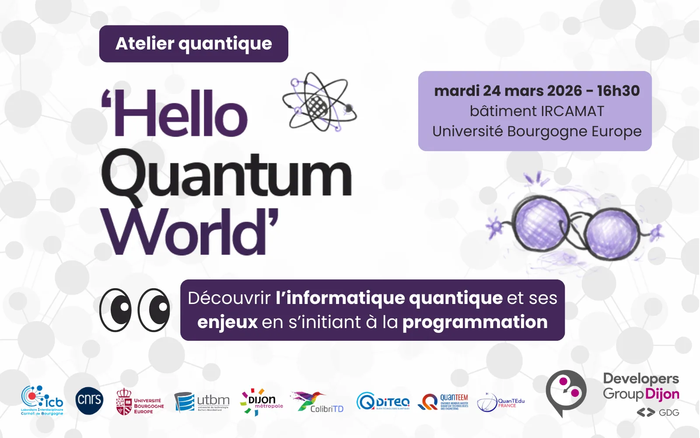

Mardi 24 mars 2026 📍 Salle E-101, IRCAMAT (Université Bourgogne Europe, Dijon) ⏰ 16h30

En 1985, le physicien David Deutsch publiait l’article Quantum theory, « the Church–Turing principle and the universal quantum computer », dans lequel il posait les bases du calcul quantique et présentait le premier algorithme quantique.

Quarante ans plus tard, alors que les avancées théoriques ont identifié les problèmes pour lesquels un ordinateur quantique pourrait offrir un avantage significatif, la course à la construction de machines capables d’atteindre cet avantage est bien lancée.

Mais concrètement : De quel avantage parle-t-on ? Quels types de problèmes peut-on espérer résoudre à court et moyen terme ? Aujourd’hui, à quoi sert réellement un ordinateur quantique ?

Dans cette conférence interactive, animée par Frédéric Holweck, Maître de Conférences à l’UTBM, ces questions seront abordées du point de vue des algorithmes.

Au programme :

↪️ introduction aux principes fondamentaux du calcul quantique

↪️ comment implémenter des algorithmes quantiques de base à l’aide de la bibliothèque open source MPQP

↪️ panorama des recherches actuelles, académiques et industrielles, autour des algorithmes quantiques et de leurs applications potentielles

Inscription gratuite mais obligatoire : https://my.weezevent.com/atelier-quantique-hello-quantum-world

