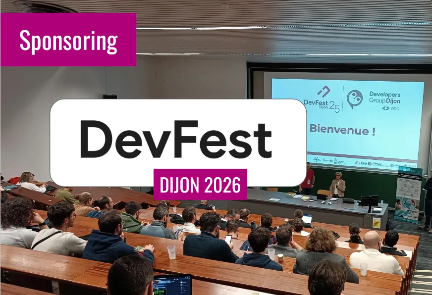

📣 La 5ème édition du DevFest Dijon se tiendra vendredi 4 décembre 2026 à l’Université Bourgogne Europe / Campus Mirande !

== ❤️ *Soutenez le DevFest Dijon 2026 en sponsorisant l’événement !*

↪️ link:Dossier-sponsoring-DevFest-2026_.pdf[Détail des offres de sponsoring]

↪️ https://docs.google.com/forms/d/e/1FAIpQLSddDd_9gx9l3OT-xBqFjAvErFmxJC_poR90sPgFmcxTi9B4KQ/viewform[Formulaire de demande de sponsoring]

_« Nous arrivons à la 5ème édition du DevFest Dijon et l’événement n’a fait que prendre en ampleur d’année en année. De 150 inscrits à la première édition, nous avons passé la barre des 500 participants en 2025 !  Pour cette édition, l’objectif est de travailler encore sur les programmes, les animations et les formats pour proposer une expérience inédite aux participants. »_ *La team (très motivée !) Developers Group Dijon*
