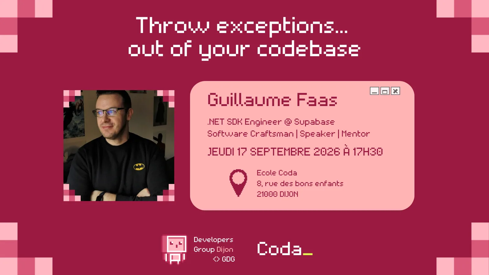

Lancer des exceptions est souvent utilisé pour gérer les erreurs, les validations et d’autres cas particuliers. Beaucoup considèrent cette approche comme la manière standard d’indiquer un échec et de fournir du feedback à l’appelant.

Pourtant, cela peut causer des problèmes significatifs : difficile à détecter, elle obscurcit le flow et peut laisser le système dans un état invalide.

Dans ce talk, https://www.linkedin.com/in/guillaumefaas/[Guillaume Faas] va nous montrer une alternative plus rapide, offrant davantage de transparence et de prédictabilité. Ainsi nous verrons comment intégrer des idées issues du paradigme Fonctionnel, comme les « Monads », dans une base de code Orientée Objet, à travers un projet concret : le SDK .NET open-source de Vonage.

____
Ce talk sera l’occasion idéale de découvrir ce que sont ces concepts et à quel point ils sont simples à adopter.
____

== À propose de Guillaume

J’aide les développeurs à construire de meilleurs logiciels. Ces dernières années, je me suis concentré sur le partage de mon expérience à travers le mentorat, les conférences et les contributions open-source — le tout dans l’objectif d’aider les équipes à progresser et à construire des logiciels durables.

Avec près de 15 ans d’expérience en développement .NET, j’ai travaillé dans de nombreux secteurs en tant qu’engineer, coach, et désormais developer advocate.

Je me concentre aujourd’hui sur la developer experience : construire des SDKs, rédiger du contenu technique accessible, et intervenir dans des conférences à travers le monde. Je crois que la qualité n’est pas optionnelle.

L’Extreme Programming, la Continuous Delivery et l’amélioration continue sont au cœur de tout ce que je fais. Je partage régulièrement ces valeurs à travers des workshops, du mentoring et des talks, dont mon récent « Throw Exceptions… Out of Your Codebase ». Toujours partant pour échanger, apprendre et contribuer — que ce soit autour de .NET, du DevRel ou du Software Craftsmanship.

📅 *Jeudi 17 septembre 2026 – de 17h30 à 19h30* 📍 https://maps.app.goo.gl/fF4j92JZu8HENLn98[*École Coda Dijon*, 8 rue des Bons Enfants, Dijon]

🎟️ *Inscription gratuite* (places limitées !) via *weezevent* : https://my.weezevent.com/throw-exceptions-out-of-your-codebase

https://my.weezevent.com/throw-exceptions-out-of-your-codebase

